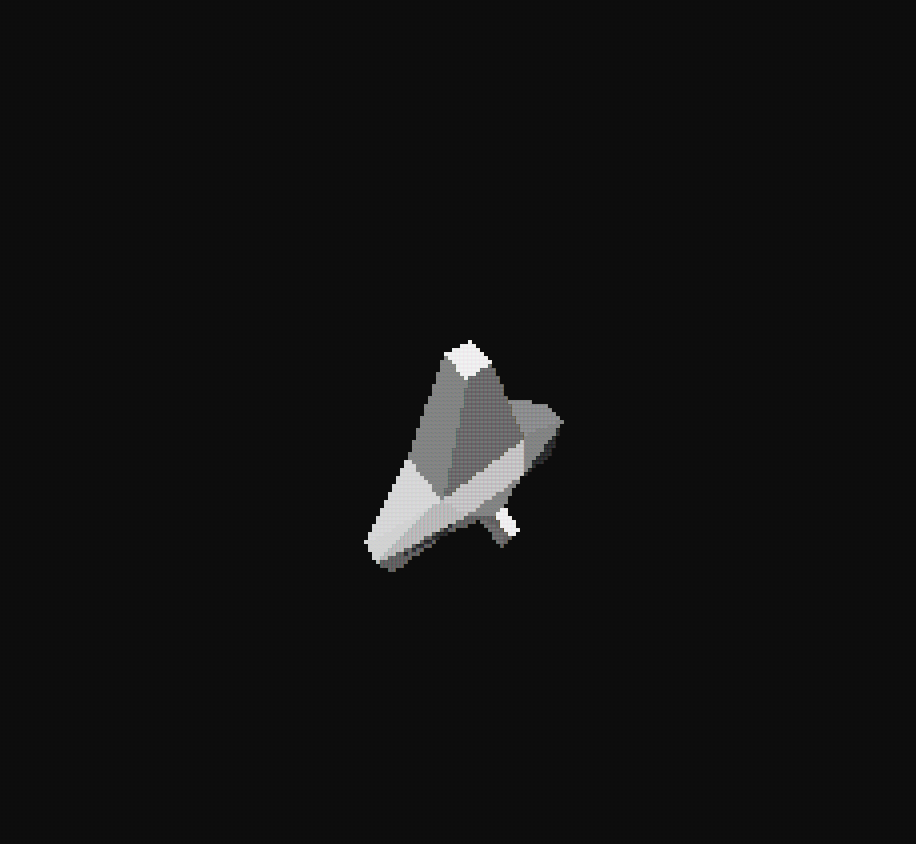

# 3DGraphicsSandbox
# Rotating 3D Cube in Console (Using `olcConsoleGameEngine`)

This is my first step into the world of **3D graphics programming**, implemented using C++ and the `olcConsoleGameEngine.h` by [Javidx9](https://github.com/OneLoneCoder).

---

## What I’ve Learned So Far

- How 3D objects are represented using vertices and triangles  
- Basics of rotation using **rotation matrices** (X and Z axis)  
- Applying **projection matrices** to simulate perspective  
- Transforming 3D coordinates into 2D screen space  
- Introduction to animation through updating the angle `fTheta` over time  
- Importance of scaling only X and Y coordinates for projection  
- Simple 3D rendering pipeline in a console environment  

---

## Why I’m Doing This

I'm actively learning about:  
- Linear algebra in graphics (matrices, vectors)  
- 3D rendering concepts and pipeline  
- Console-based visualization as a stepping stone to OpenGL or DirectX  

This is not just a project, but a personal learning milestone. I plan to eventually **rebuild this engine from scratch** without relying on external libraries.

---

## Preview

 <!-- Replace this path with your actual gif path -->

---

## Credits

- **Javidx9 / OneLoneCoder** – for `olcConsoleGameEngine.h` and the [3D Graphics tutorial series](https://www.youtube.com/watch?v=ih20l3pJoeU)

---

## What’s Next

- Review the source code of `olcConsoleGameEngine.h` and understand how it works internally  
- Try creating my own minimal 3D engine from scratch  
- Learn more about transformations, camera systems, and shading  

---

